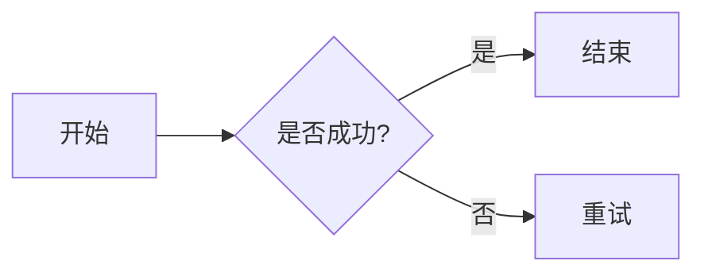

### Markdown 语法入门

#### 一、什么是 Markdown？

Markdown 是一种轻量级标记语言，它允许你使用易读易写的纯文本格式编写文档，然后转换成结构化的 HTML 或 PDF。

**核心优势**：

- **专注内容**：无需像 Word 那样频繁调整字体和间距，让你专注于写作本身。
- **跨平台通用**：支持几乎所有代码编辑器（VS Code）、笔记软件（Obsidian, Notion）和博客平台。
- **易于转换**：可一键导出为 HTML、PDF、Word 等多种格式。

#### 二、核心语法速查表

以下是 Markdown 最常用的基础语法，掌握这些即可应对 90% 的日常写作场景。

**1. 标题**
使用`#`号表示标题，`#`的数量代表标题级别（1-6 级）。

```markdown
# 一级标题 (通常用于文章主标题)
## 二级标题 (章节标题)
### 三级标题 (小节标题)
#### 四级标题
```

**2. 文本样式**
使用符号包裹文字来实现强调效果。


| 效果         | 语法示例       | 说明                    |
| :----------- | :------------- | :---------------------- |
| **粗体**     | `**这是粗体**` | 双星号或双下划线        |
| *斜体*       | `*这是斜体*`   | 单星号或单下划线        |
| ***粗斜体*** | `***粗斜体***` | 三星号                  |
| ~~删除线~~   | `~~删除内容~~` | 双波浪线                |
| ==高亮==     | `==高亮内容==` | 双等号 (部分编辑器支持) |

**3. 列表**
列表用于整理清单或步骤。

- **无序列表**：使用`-`、`+`或`*`加空格。
- **有序列表**：使用`数字.`加空格。
- **任务列表**：使用`- [ ]`（未完成）或`- [x]`（已完成）。

**示例代码**：

```markdown
- 苹果
- 香蕉
  - 嵌套项目 (前面加两个空格或 Tab)

1. 第一步
2. 第二步

- [ ] 待办事项
- [x] 已完成事项
```

**4. 引用**
使用`>`符号来引用文本，常用于标注名言或重点。

```markdown
> 这是一段引用文本。
> > 甚至可以嵌套引用。
```

**5. 链接与图片**
两者的语法非常相似，区别在于图片多一个感叹号`!`。

- **链接**：`[链接文字](链接地址 "可选标题")`
- **图片**：``

**示例**：

```markdown
[访问 Google](https://www.google.com)

```

**6. 代码块**
程序员必备功能，支持语法高亮。

- **行内代码**：使用反引号 `` `代码` `` 包裹。
- **代码块**：使用三个反引号 ``` 包裹，并可指定语言。

**示例**：

````markdown
```python
def hello():
    print("Hello, Markdown!")
```
````

**7. 表格**
使用`|`分隔列，使用`-`分隔表头。冒号`:`用于控制对齐方式。

**示例代码**：

```markdown
| 左对齐 | 居中对齐 | 右对齐 |
| :----- | :----: | -----: |
| 单元格 | 单元格 | 单元格 |
| 内容 A | 内容 B | 内容 C |
```

**8. 分隔线**
使用三个或更多的`-`或`*`来创建水平分割线。

```markdown
---
***
```

#### 四、进阶技巧（扩展语法）

部分编辑器（如 Typora, Obsidian, GitHub）支持更高级的语法。

**1. 数学公式**
支持 LaTeX 语法。

- **行内公式**：`$E=mc^2$`
- **独行公式**：`$$ \sum_{i=1}^n a_i=0 $$`

**2. 流程图与图表**
许多现代编辑器支持 Mermaid 语法，可以直接画图。

**示例**：


